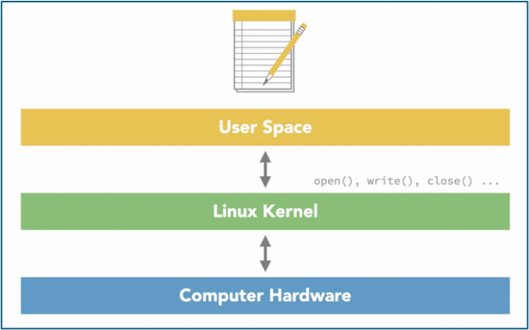

# Introduction to Linux

## What is Linux?
Linux is the name that we commonly use for operating systems that are built around the Linux Kernel. Operating systems based on Linux kernel are called Linux distributions. It is based on the idea of free & open source software, software whose source code we can view, edit & change to suit our needs.
The Linux is used in :
  - Desktop environment at home.
  - Software development platform at work.
  - Runs world’s largest & most powerful supercomputers.

## The Linux Kernel
Linux is kernel of operating system. It is an open source software, that communicates with the computer’s hardware, in order to give other softwares (text editor, Audio player) access to resources.

## High Level Working of Kernel
Applications (text editor) usually runs in user space. When they perform some operation which requires access to hardware resources, then application communicates with kernel using system calls & kernel communicates with hardware resources which includes memory, processor, storage, network & so on. 

Let’s understand it with the example of saving a file in a text editor. When save operation is performed, text editor software uses a user space library to tell the kernel what to save & where to save it. Kernel then communicates this information to the storage medium & reports back that the operation succeeded.

## Linux Kernel Customization
Linux kernels are customized to run on different kinds of processors so that it can be used in variety of situations such as tiny devices like circuit boards, on supercomputers, on laptops, on mobile devices and even in cars.

## Adding Software to Linux System
All linux distributions (Ubuntu, RHEL, Fedora, CentOS, Kali) maintain their software packages in a location called Repositories. Package management softwares (Apt, yum) are used to download software packages & install them in the appropriate places in the system.

## How Package Management Software works
Package management softwares copy the content, libraries &  documentation of software packages into specific locations where system can find it. We can also use source code to build software to use on our own system if we want to. Another way of installing software is by using platform-independent software bundles. Example for the same are snaps, flatpak & AppImage.
To summarize, 3 ways to install software packages in Linux are:
  - Using package manager to download & install
  - Using platform independent software bundles such as Snaps, Flatpak & AppImage.
  - By downloading source code & compiling it by yourself using Cmake.

## Linux File System
To store data on Linux system, we use files & directories. These files & directories make up the file system. In order to organize files consistently on Linux systems, most distributions follow the Filesystem Hierarchy Standard (FHS). This standard makes it possible for us to switch between distributions easily & maintain consistent locations across distributions.

On a Linux system, there’s only one file system root represented by slash (/). Even if we plug in other storage devices, those become part of the overall file system and aren’t represented as separate file systems, like we might be used to of seeing on a windows system with C & D drives. It can be thought of like windows “My computer” section.

## Important Directories under root directory
Under root directory (/), there are variety of directories each with a specific purpose. Some of the important directories defined by the FHS includes:
  - **Home** directory where each user’s personal files are stored. 
  - **bin, sbin & usr** directories, where programs of different types are kept.
  - **mnt or media** directories, which are used for mounting or attaching other file systems, like you’d find on network shares and other disks.
  - **etc** directory is used to store system wide configuration files.
  - **var** directory is where changeable or variable system information is kept, this is where we’ll find system logs & logs for other software.
  - **Dev, proc & sys** directories are not real directories, they are created by the kernel to represent hardware available on the system, including all the system’s hardware, processes that run programs, settings in the kernel, and so on.

## User & System security
Linux uses a multi-user model where each user can have separate user account with separate files and settings. And the same is true for software and services. Some programs and services, especially things like a web server, a database server, and other software that isn't tied to a particular human user often run using their own user account. Usually, these accounts, human and software, are standard accounts. They aren't allowed to make changes to the system or to files outside of their own space.

On Linux systems, there is a superuser or administrator account called root, which has the privilage to access any file on the system and to change settings on a system wide basis. We can use the root account directly, or we can borrow its privileges temporarily. For safety and security reasons, we'll rarely use computer under the root account.

## User Permissions
User permissions is a way to represent which user has which rights to do which operations on which files. Permissions let us indicate whether a user or members of a particular group, or anyone at all can read from a given file, write data to it, or execute or run it.

Permissions are often represented either as numbers or as letters, and in each case, they're made up of three sections, one for the user, one for the group, and one representing all others. Each section represents the restrictions applied to the file for that audience. Permission can be modified using chmod, chown & chgrp command.